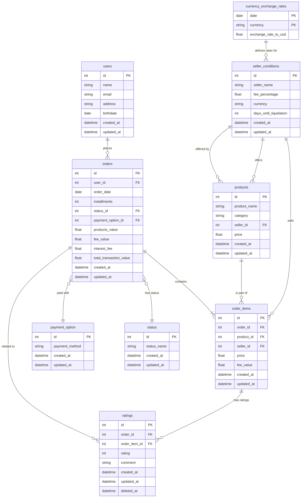
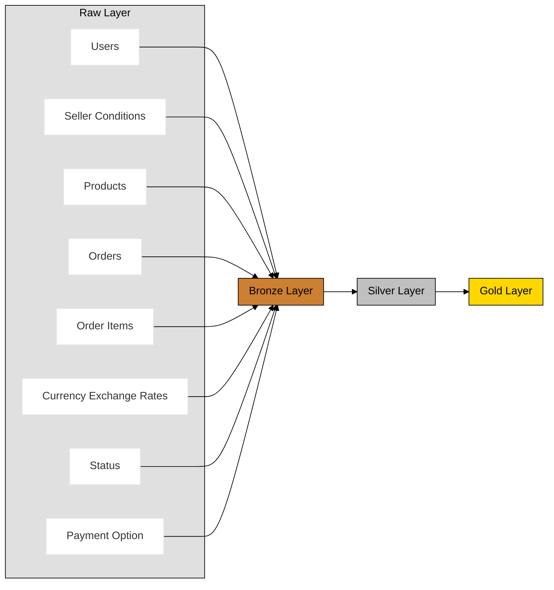

# DBT Sales Project

## Idea
Use fake data to work with dbt models in conjunction with a bigquery data warehouse, the purpose is to have raw, bronze, silver and gold layers and process the data among the layers using dbt to answer stakeholder's questions.

## The source data
I designed a relational database of sales with some basic tables, the data itself was generated and uploaded to the raw layer using the data_uploader.py file (I explained the tables and relationships to chatGPT and let him do the script =)).

### Tables and Relationships Explanation

- **users**
  - **id**: Primary key.
  - **name**, **email**, **address**: User details.
  - **Relationship**: Each user can place multiple orders.

- **seller_conditions**
  - **id**: Primary key.
  - **seller_name**, **fee_percentage**, **currency**, **days_until_liquidation**: Seller details and conditions.
  - **Relationship**:
    - Offers multiple products.
    - Sells items in order items.
    - Associated with currency exchange rates based on the currency.

- **products**
  - **id**: Primary key.
  - **product_name**, **seller_id**, **price**: Product details.
  - **Relationship**:
    - Each product is offered by one seller (seller_conditions).
    - A product can be part of many order items.

- **orders**
  - **id**: Primary key.
  - **user_id**, **order_date**, **installments**, **products_value**, **fee_value**, **interest_fee**, **total_transaction_value**: Order details.
  - **Relationship**:
    - Placed by one user.
    - Contains multiple order items.

- **order_items**
  - **id**: Primary key.
  - **order_id**, **product_id**, **seller_id**, **price**, **fee_value**: Order item details.
  - **Relationship**:
    - Belongs to one order.
    - Includes one product.
    - Sold by one seller (seller_conditions).

- **currency_exchange_rates**
  - **date**, **currency**: Composite primary key.
  - **exchange_rate_to_usd**: Exchange rate on a given date.
  - **Relationship**:
    - Provides exchange rates for currencies used by sellers.

### Datawarehouse Layers definition

For the layers I decided to user a simple bronze, silver, gold structure with the following approach (I'll add the tables relationship as I build them downstream).

## Questions to be Answered by the Warehouse

1. **What is the total revenue generated over the past year, and how does it trend over months and quarters?**
   - Analyze `total_transaction_value` over time to identify sales trends and seasonality.

2. **Which products are our top sellers in terms of units sold and revenue generated?**
   - Identify products with the highest sales volumes and revenues to inform inventory and marketing strategies.

3. **Who are our top-performing sellers based on total sales and number of orders fulfilled?**
   - Rank sellers by `products_value` and number of orders to recognize high performers and address underperformers.

4. **What is the repeat purchase rate among our customers?**
   - Calculate the percentage of customers who have made multiple purchases to assess customer loyalty.

5. **How does the average order value vary across different customer segments?**
   - Analyze `total_transaction_value` by customer demographics or purchasing behavior to tailor marketing efforts.

6. **How does the mismatch between customer installment payments and seller liquidation affect our cash flow?**
   - Examine the timing of cash inflows from customers versus cash outflows to sellers to identify potential cash flow gaps.

7. **Is the interest fee collected from customers sufficient to compensate for delayed cash inflow and the cost of capital?**
   - Compare `interest_fee` revenue against the cost of financing the cash flow gap to ensure profitability.

8. **What is the distribution of orders by the number of installments chosen, and how does it affect interest revenue?**
   - Create a breakdown of `installments` to understand customer payment preferences and associated `interest_fee` income.

9. **How do currency fluctuations impact our revenue and profitability?**
   - Assess the effect of `exchange_rate_to_usd` variations on `total_transaction_value` to manage financial risk.

10. **Which currencies contribute the most to our sales, and should we focus on specific markets?**
    - Analyze sales by `currency` to identify key markets and opportunities for expansion.

11. **Are there correlations between seller fee percentages, days until liquidation, and seller performance?**
    - Investigate how `fee_percentage` and `days_until_liquidation` influence seller sales volumes and satisfaction.

12. **What strategies can we implement to optimize cash flow management considering installment payments and seller liquidation timing?**
    - Explore options such as adjusting installment offerings or negotiating seller payment terms to improve liquidity.
