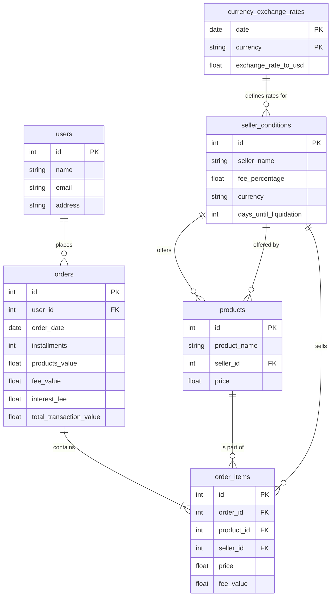

# DBT Sales Project

## Idea
Use fake data to work with dbt models in conjunction with a bigquery data warehouse, the purpose is to have raw, bronze, silver and gold layers and process the data among the layers using dbt.

## The data
I designed a relational database of sales with some basic tables:

### Resources:
- Learn more about dbt [in the docs](https://docs.getdbt.com/docs/introduction)
- Check out [Discourse](https://discourse.getdbt.com/) for commonly asked questions and answers
- Join the [chat](https://community.getdbt.com/) on Slack for live discussions and support
- Find [dbt events](https://events.getdbt.com) near you
- Check out [the blog](https://blog.getdbt.com/) for the latest news on dbt's development and best practices
