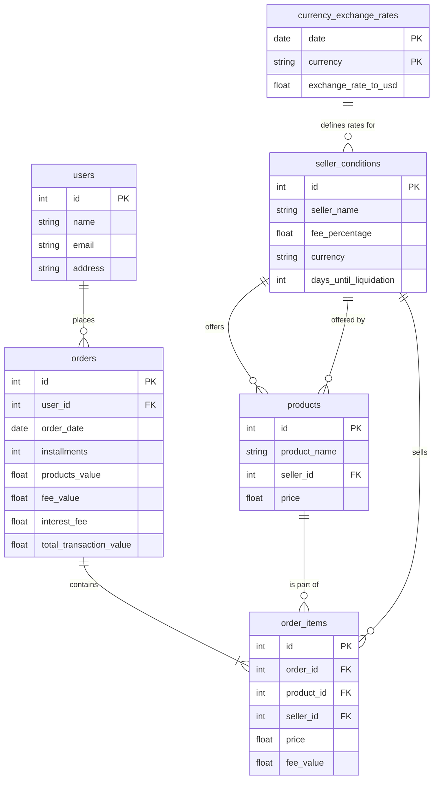
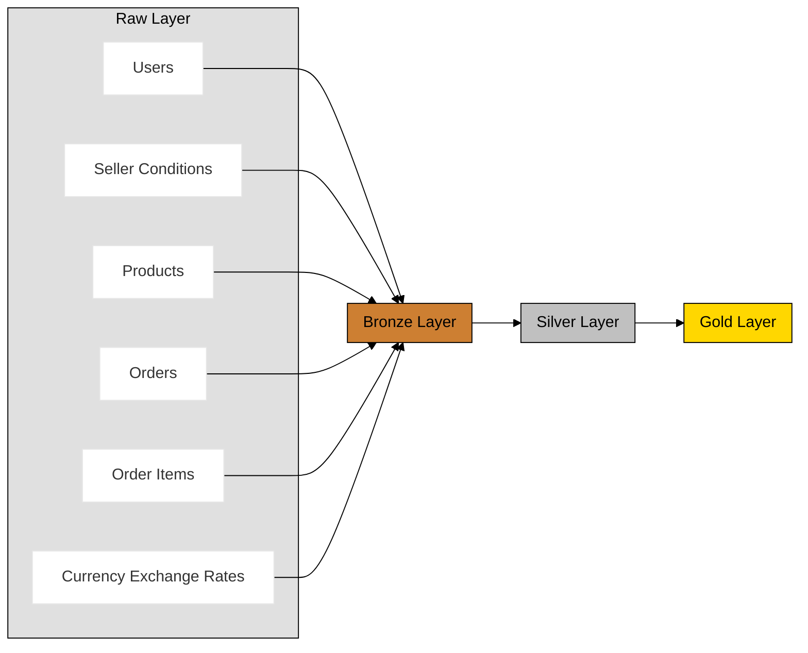

# DBT Sales Project

## Idea
Use fake data to work with dbt models in conjunction with a bigquery data warehouse, the purpose is to have raw, bronze, silver and gold layers and process the data among the layers using dbt.

## The source data
I designed a relational database of sales with some basic tables, the data itself was generated and uploaded to the raw layer using the data_uploader.py file (I explained the tables and relationships to chatGPT and let him do the script =)).

### Tables and Relationships Explanation

- **users**
  - **id**: Primary key.
  - **name**, **email**, **address**: User details.
  - **Relationship**: Each user can place multiple orders.

- **seller_conditions**
  - **id**: Primary key.
  - **seller_name**, **fee_percentage**, **currency**, **days_until_liquidation**: Seller details and conditions.
  - **Relationship**:
    - Offers multiple products.
    - Sells items in order items.
    - Associated with currency exchange rates based on the currency.

- **products**
  - **id**: Primary key.
  - **product_name**, **seller_id**, **price**: Product details.
  - **Relationship**:
    - Each product is offered by one seller (seller_conditions).
    - A product can be part of many order items.

- **orders**
  - **id**: Primary key.
  - **user_id**, **order_date**, **installments**, **products_value**, **fee_value**, **interest_fee**, **total_transaction_value**: Order details.
  - **Relationship**:
    - Placed by one user.
    - Contains multiple order items.

- **order_items**
  - **id**: Primary key.
  - **order_id**, **product_id**, **seller_id**, **price**, **fee_value**: Order item details.
  - **Relationship**:
    - Belongs to one order.
    - Includes one product.
    - Sold by one seller (seller_conditions).

- **currency_exchange_rates**
  - **date**, **currency**: Composite primary key.
  - **exchange_rate_to_usd**: Exchange rate on a given date.
  - **Relationship**:
    - Provides exchange rates for currencies used by sellers.

### Datawarehouse Layers definition

For the layers I decided to user a simple bronze, silver, gold structure with the following approach (I'll add the tables relationship as I build them downstream).

